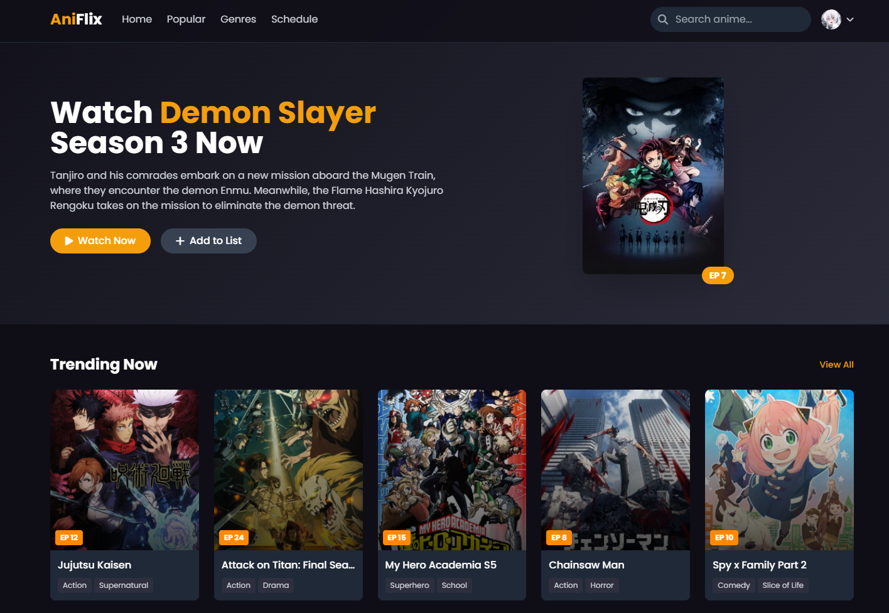
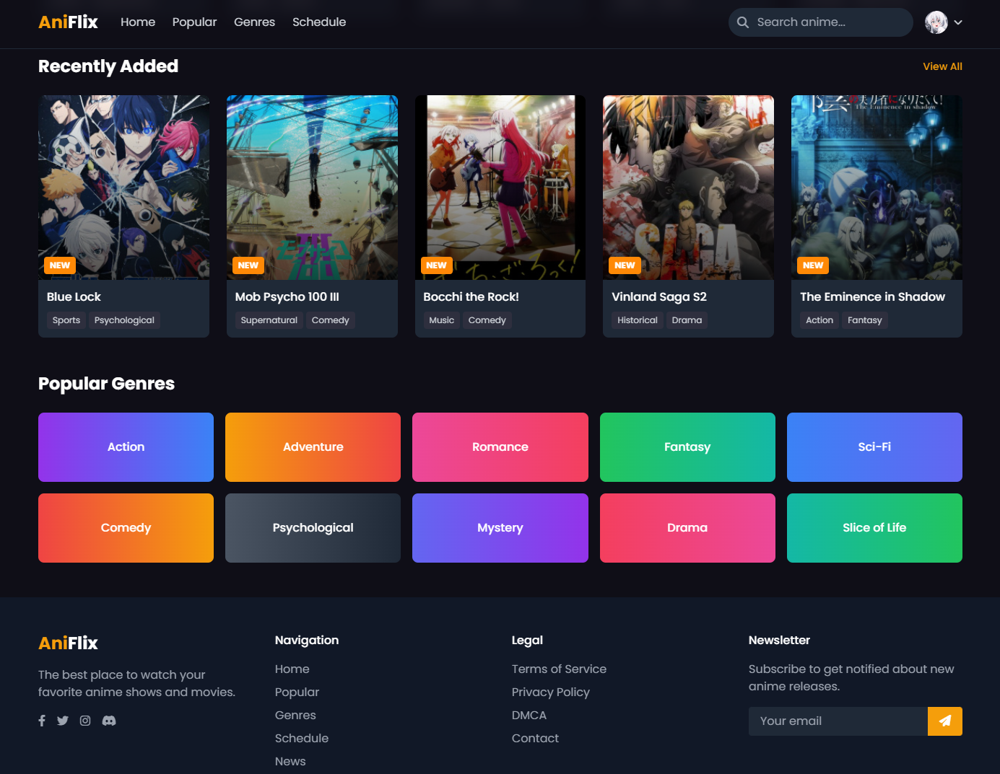

# AniFlex - Anime Streaming Web App


---



A modern, sleek anime streaming web application with a focus on user experience and performance.

---

## Table of Contents

- [✨ Features](#features)
- [🚀 Installation](#installation)
- [🎮 Usage](#usage)
- [🤝 Contributing](#contributing)
- [📜 License](#license)

---

## ✨ Features

### Lightning Fast Streaming ⚡️
Optimized video delivery with adaptive bitrate streaming for smooth playback on any connection.

### Beautiful UI 🎨
Sleek, modern interface with dark mode by default to reduce eye strain during long viewing sessions.

### Watchlist 📋
Save your favorite shows and track your progress across multiple devices.

### AI Recommendations 🤖
Smart suggestions based on your viewing history and preferences.

---

## 🚀 Installation

1. **Clone the repository:**
   ```bash
   git clone https://github.com/dani-fernando/Aniflex.git
   cd Aniflex
   ```

2. **Run file index:**
   ```bash
   open file index.html
   ```

---

## 🤝 Contributing

We welcome contributions from the community! Here's how you can help improve AniFlex:

1. Fork the repository.
2. Create your feature branch:
   ```bash
   git checkout -b feature/amazing-feature
   ```
3. Commit your changes:
   ```bash
   git commit -m "Add some amazing feature"
   ```
4. Push to the branch:
   ```bash
   git push origin feature/amazing-feature
   ```
5. Open a Pull Request.

### Guidelines

- Ensure your code follows the existing style (ESLint config provided).
- Write clear commit messages.
- Update the documentation when necessary.
- Add tests for new features.

---

## 📜 License


AniFlex is open-source software licensed under the MIT license. This means you're free to use, modify, and distribute the code for personal and commercial purposes.

[View Full License](#)

---

## Credit

Made with ❤️ by Dani Fernando
© 2025 AniFlex Project. All rights reserved.
 
[](#)  
[](#)  
[](#)
```

---
